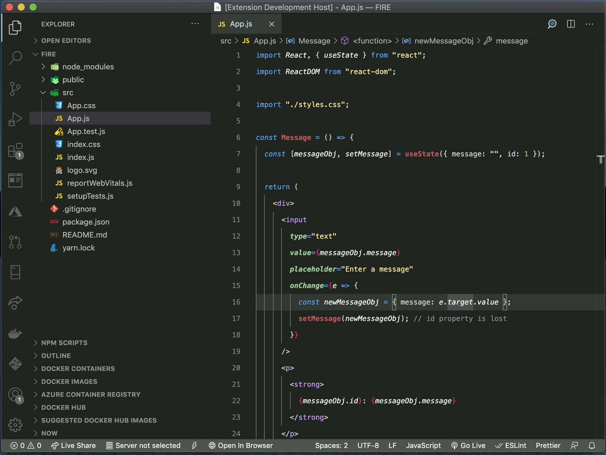
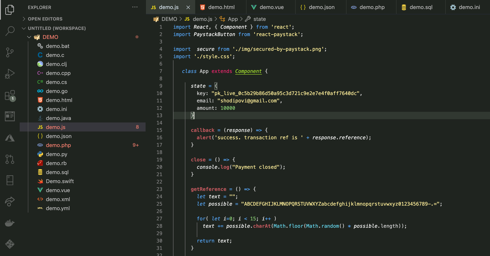
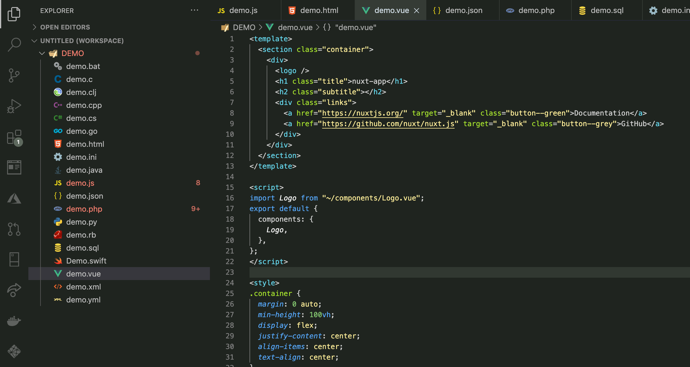
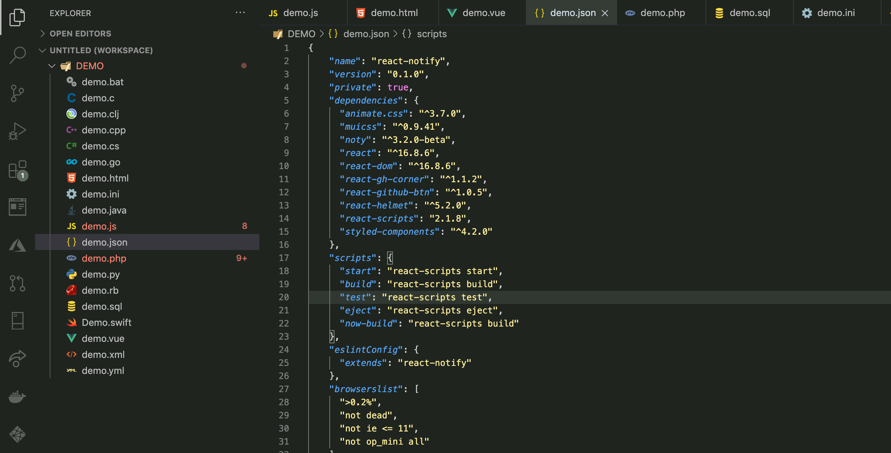
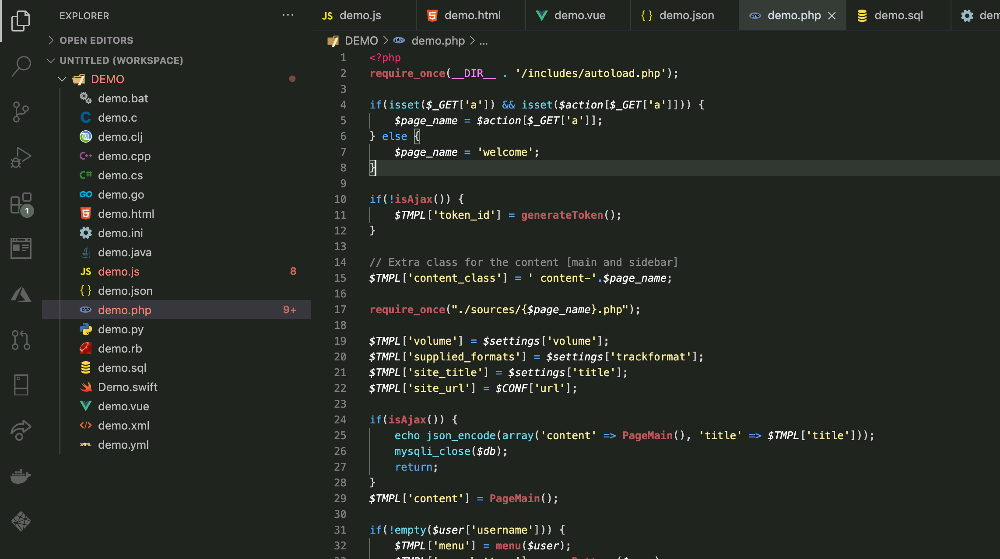
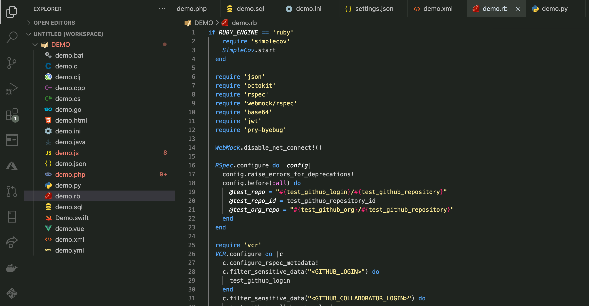
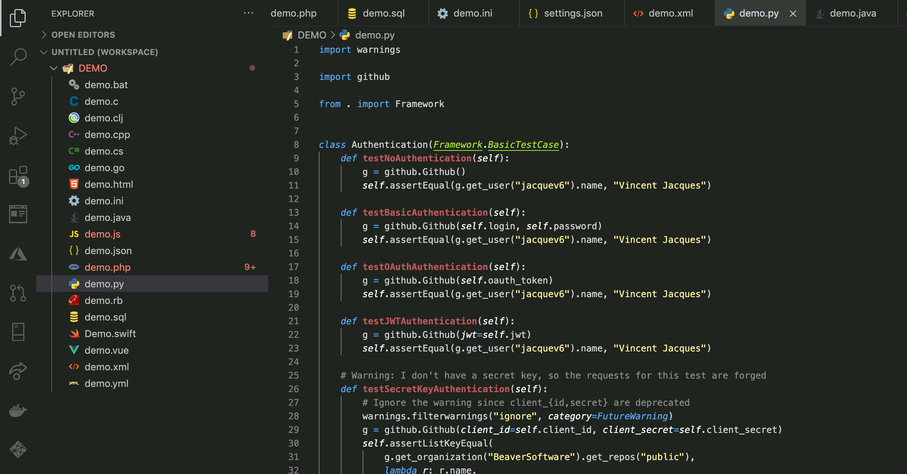
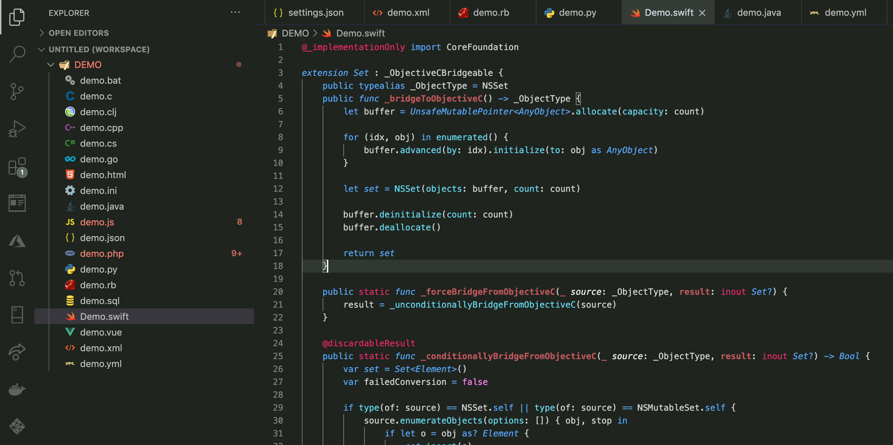
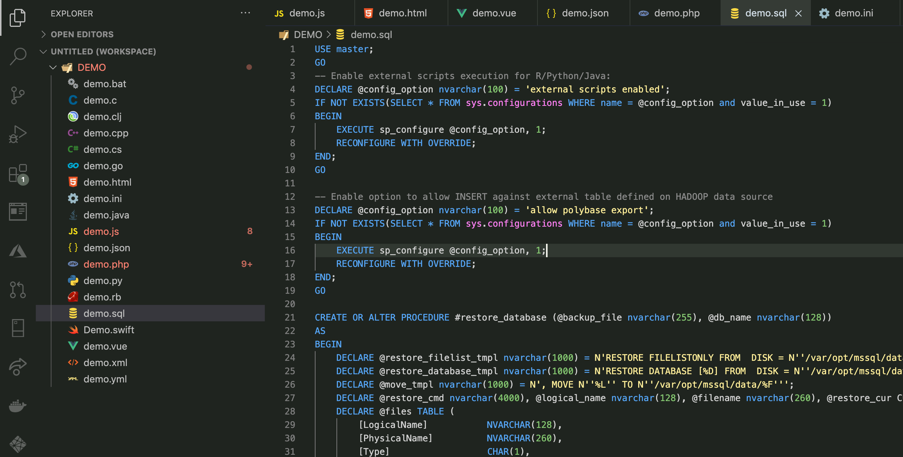
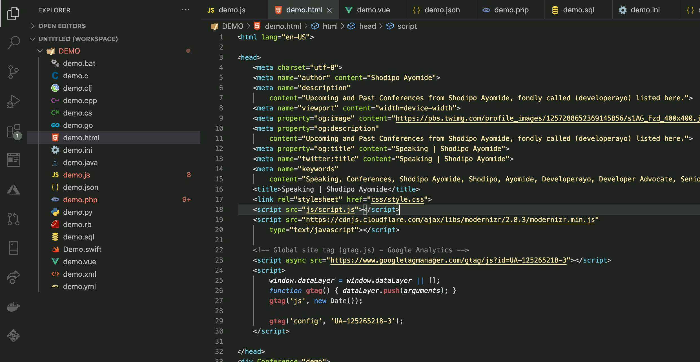

# Tsukuyomi 🔥 
A visual studio code theme for Naruto & Anime Lovers.

 

A Visual Studio Code theme for the Naruto & Anime lovers out there, all colors where chosen carefully from sugestions from many other Naruto/Anime loves acorss the globe and are implemented in this theme.

# How it looks 🔧 

Every colors where carefully selected from sugegestions from top Naruto / anime lovers who are engineers, and below is how tsukuyomi looks:

## React

## Vue

## JSON

## PHP

## Ruby

## Java

## Python

## Swift

## SQL

## HTML

# Installation
- Install Visual Studio Code
- Launch Visual Studio Code
- Choose Extensions from menu
- Search for Tsukuyomi
- Click Install to install it
- Click Reload to reload the Code
- From the menu bar click: Code > Preferences > Color Theme > Tsukuyomi
- 🌟 Rate five-stars to appreciate the effort behind this theme :)

# License

This theme is released under the MIT License.

✨ Designed by Shodipo Ayomide in Lagos, Nigeria